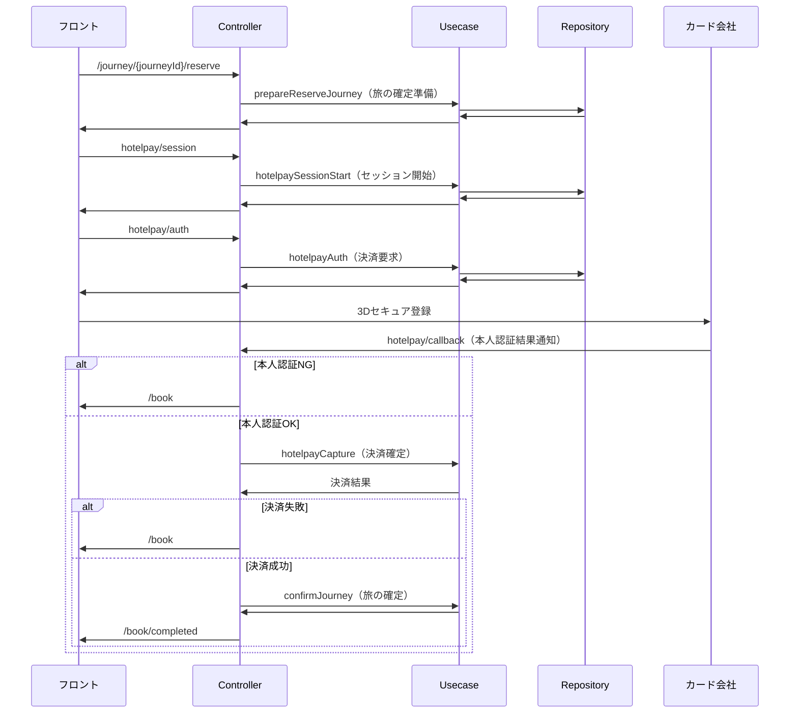

```mermaid
sequenceDiagram
    participant フロント
    participant Controller
    participant Usecase
    participant Repository
    participant カード会社

フロント->>Controller: /journey/{journeyId}/reserve
Controller->>Usecase: prepareReserveJourney（旅の確定準備）
Usecase->>Repository: 
Repository->>Usecase: 
Usecase->>Controller: 
Controller->>フロント: 
    
フロント->>Controller: hotelpay/session
Controller->>Usecase: hotelpaySessionStart（セッション開始）
Usecase->>Repository: 
Repository->>Usecase: 
Usecase->>Controller: 
Controller->>フロント: 

フロント->>Controller: hotelpay/auth
Controller->>Usecase: hotelpayAuth（決済要求）
Usecase->>Repository: 
Repository->>Usecase: 
Usecase->>Controller: 
Controller->>フロント: 

フロント->>カード会社: 3Dセキュア登録
カード会社->>Controller: hotelpay/callback（本人認証結果通知）
alt 本人認証NG
Controller->>フロント: /book
else 本人認証OK
    Controller->>Usecase: hotelpayCapture（決済確定）
    Usecase->>Controller: 決済結果
    alt 決済失敗
        Controller->>フロント: /book
    else 決済成功
        Controller->>Usecase: confirmJourney（旅の確定）
        Usecase->>Controller:　
        Controller->>フロント: /book/completed
    end
end

```